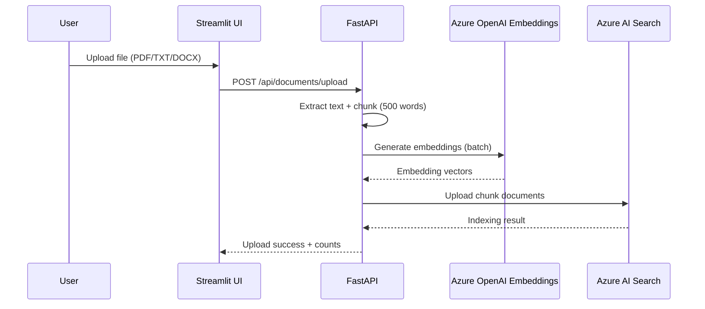
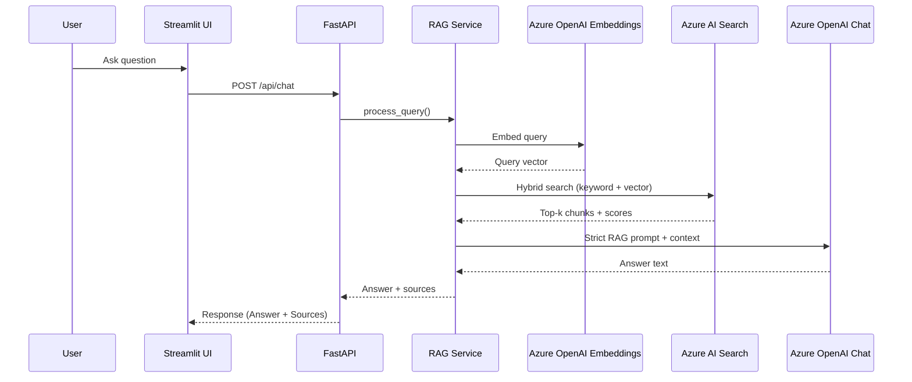
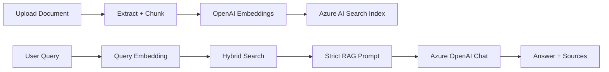

# RAG Chatbot Scaffold (FastAPI + Streamlit)

## Project Overview
This repository provides a professional scaffold for a Retrieval-Augmented Generation (RAG) chatbot built with FastAPI, Azure AI Search, and Azure OpenAI. The backend exposes a simple chat API, while the Streamlit frontend delivers a lightweight chat interface.

## Architecture Diagram
```mermaid
flowchart LR
  UI[Streamlit UI] --> API[FastAPI /api/chat]
  API --> RAG[RAG Service]
  RAG --> SEARCH[Azure AI Search]
  RAG --> OPENAI[Azure OpenAI (Chat)]
```

## Setup Instructions
1. Create and activate a Python virtual environment (Python 3.10+).
2. Install backend dependencies:
   ```bash
   pip install -r backend/requirements.txt
   ```
3. Install frontend dependencies:
   ```bash
   pip install -r frontend/requirements.txt
   ```
4. Copy `backend/.env.example` to `backend/.env` and fill in your Azure credentials.

## Environment Variables
The backend requires the following variables:
- `AZURE_SEARCH_SERVICE_ENDPOINT`: Azure AI Search endpoint URL.
- `AZURE_SEARCH_ADMIN_KEY`: Azure AI Search admin key.
- `AZURE_SEARCH_INDEX_NAME`: Search index name.
- `AZURE_OPENAI_ENDPOINT`: Azure OpenAI endpoint URL.
- `AZURE_OPENAI_API_KEY`: Azure OpenAI API key.
- `AZURE_OPENAI_DEPLOYMENT_NAME`: Azure OpenAI deployment name.
- `AZURE_OPENAI_API_VERSION`: Azure OpenAI API version.
- `AZURE_OPENAI_EMBEDDING_DEPLOYMENT_NAME`: Azure OpenAI embedding deployment name.
- `AZURE_FORM_RECOGNIZER_ENDPOINT`: Azure Form Recognizer endpoint (required for PDF uploads).
- `AZURE_FORM_RECOGNIZER_KEY`: Azure Form Recognizer key (required for PDF uploads).
- `EMBEDDING_DIMENSIONS`: Embedding vector size (must match the model output).
- `AZURE_SEARCH_USE_SEMANTIC`: Enable semantic search when available (default: `true`).
- `AZURE_SEARCH_AUTO_CREATE_INDEX`: Auto-create or update the index on first use (default: `true`).
- `MINIMUM_RELEVANCE_SCORE`: Minimum relevance score to use a document in answers (default: `0.7`).

The frontend can optionally use:
- `BACKEND_URL`: Backend base URL (default: `http://localhost:8000`).

## Running the Backend
From the repository root:
```bash
uvicorn app.main:app --reload --app-dir backend
```

## Running the Frontend
From the repository root:
```bash
streamlit run frontend/app.py
```

## Deploy on Azure Web Apps (Two Linux Web Apps)
Deploy backend and frontend as two separate App Service apps.

### 0) Security first
- Rotate any previously exposed secrets immediately:
  - `AZURE_SEARCH_ADMIN_KEY`
  - `AZURE_OPENAI_API_KEY`
  - `AZURE_FORM_RECOGNIZER_KEY` (if used)
- Keep `backend/.env.example` as placeholders only.
- Store all runtime secrets in Azure App Settings (or Key Vault references).

### 1) Create Azure resources
```bash
az group create -n rg-rag-prod -l eastus
az appservice plan create -g rg-rag-prod -n plan-rag-prod --is-linux --sku B1
az webapp create -g rg-rag-prod -p plan-rag-prod -n <backend-app-name> --runtime "PYTHON|3.11"
az webapp create -g rg-rag-prod -p plan-rag-prod -n <frontend-app-name> --runtime "PYTHON|3.11"
```

Set health check paths:
```bash
az webapp config set -g rg-rag-prod -n <backend-app-name> --generic-configurations '{"healthCheckPath":"/api/health"}'
az webapp config set -g rg-rag-prod -n <frontend-app-name> --generic-configurations '{"healthCheckPath":"/"}'
```

### 2) Configure backend Web App
Set these App Settings on backend:
- `AZURE_SEARCH_SERVICE_ENDPOINT`
- `AZURE_SEARCH_ADMIN_KEY`
- `AZURE_SEARCH_INDEX_NAME`
- `AZURE_OPENAI_ENDPOINT`
- `AZURE_OPENAI_API_KEY`
- `AZURE_OPENAI_DEPLOYMENT_NAME`
- `AZURE_OPENAI_API_VERSION`
- `AZURE_OPENAI_EMBEDDING_DEPLOYMENT_NAME`
- `EMBEDDING_DIMENSIONS`
- `AZURE_SEARCH_USE_SEMANTIC`
- `AZURE_SEARCH_AUTO_CREATE_INDEX`
- `MINIMUM_RELEVANCE_SCORE`
- `AZURE_FORM_RECOGNIZER_ENDPOINT` (optional)
- `AZURE_FORM_RECOGNIZER_KEY` (optional)
- `SCM_DO_BUILD_DURING_DEPLOYMENT=true`
- `ENABLE_ORYX_BUILD=true`

Backend startup command:
```bash
gunicorn -k uvicorn.workers.UvicornWorker app.main:app --bind=0.0.0.0:8000
```

### 3) Configure frontend Web App
Set these App Settings on frontend:
- `BACKEND_URL=https://<backend-app-name>.azurewebsites.net`
- `SCM_DO_BUILD_DURING_DEPLOYMENT=true`
- `ENABLE_ORYX_BUILD=true`

Frontend startup command:
```bash
streamlit run app.py --server.port 8000 --server.address 0.0.0.0 --server.headless true
```

### 4) CI/CD with GitHub Actions + OIDC
This repo includes:
- `.github/workflows/deploy-backend.yml`
- `.github/workflows/deploy-frontend.yml`

Required GitHub repo secrets:
- `AZURE_CLIENT_ID`
- `AZURE_TENANT_ID`
- `AZURE_SUBSCRIPTION_ID`
- `AZURE_BACKEND_WEBAPP_NAME`
- `AZURE_FRONTEND_WEBAPP_NAME`

Workflows use `azure/login` (OIDC) and deploy `backend/` and `frontend/` independently via `azure/webapps-deploy`.

### 5) Smoke checks
1. Backend health:
   - `GET https://<backend-app-name>.azurewebsites.net/api/health`
2. Frontend availability:
   - `GET https://<frontend-app-name>.azurewebsites.net`
3. End-to-end:
   - Upload a document from frontend.
   - Run a chat query and confirm `/api/chat` returns answer + sources.
4. Failure path:
   - Temporarily set an invalid backend key in App Settings and verify frontend surfaces backend error detail.

### 6) Rollout guidance
1. Deploy backend and verify `/api/health`.
2. Deploy frontend with `BACKEND_URL` set to new backend.
3. Run smoke checks.
4. Cut over custom domain/DNS.
5. Keep an App Settings snapshot for rollback.

## Frontend Overview (UI Layout)
- Main chat window with user/assistant bubbles and markdown-rendered responses.
- Sidebar includes branding and navigation only.
- Pages: Chat, Documents, Session History, Settings.
- Documents page shows upload controls, file/chunk metrics, and delete actions.
- Settings page contains temperature, max tokens, and top-k controls.
- Session History page shows current session messages and metrics.

## User Guide
1. Upload documents on the **Documents** page (PDF, TXT, or DOCX).
2. Ask questions in the chat input and press **Enter** to send.
3. Receive a quality-normalized response from `/api/chat` (markdown + single source footer).
4. Review your current session under **Session History**.

## PDF Extraction with Azure Form Recognizer
- PDF extraction uses Azure Form Recognizer (`prebuilt-layout`).
- TXT and DOCX extraction remain local.
- Required for PDF uploads:
  - `AZURE_FORM_RECOGNIZER_ENDPOINT`
  - `AZURE_FORM_RECOGNIZER_KEY`
- Failure behavior:
  - `503` when Form Recognizer config is missing.
  - `502` when Form Recognizer service call fails.

## System Flow Diagrams
These diagrams are rendered with Mermaid (supported by GitHub and most Markdown viewers).

### 1) Document Upload Flow


### 2) Query → Retrieval → Answer Flow


### 3) End-to-End RAG Overview


## Document Upload Instructions
- Supported formats: PDF, TXT, DOCX.
- Maximum file size: 50 MB.
- Documents are chunked into 500-word segments before indexing.

## Troubleshooting Frontend Issues
- If the UI shows “Unable to reach backend,” confirm the API is running.
- Chat page uses `/api/chat` as the authoritative response path for formatting quality.
- `/api/chat/stream` is kept for compatibility integrations.
- If uploads fail, verify file type and size limits.
- If `/api/documents` or chat returns `503`, verify Azure Search network access:
  endpoint, firewall/private endpoint, VNet routing, DNS resolution, and outbound internet rules.
- For long answers, text wraps automatically inside the chat bubble.

## Azure AI Search Setup
- Create an Azure AI Search service in the portal and note the endpoint and admin key.
- Free tier has strict limits and no SLA; check current quotas in your Azure subscription.
- If you want semantic search, enable it in the portal when available for your tier and region.

## Azure OpenAI Setup
- Create an Azure OpenAI resource and deploy a chat model (e.g., GPT deployment).
- Set the following environment variables:
  - `AZURE_OPENAI_ENDPOINT`
  - `AZURE_OPENAI_API_KEY`
  - `AZURE_OPENAI_DEPLOYMENT_NAME`
  - `AZURE_OPENAI_API_VERSION`
  - `AZURE_OPENAI_EMBEDDING_DEPLOYMENT_NAME`

## Model Selection Guidelines
- Choose a chat deployment that balances latency and cost for your workload.
- For embeddings, deploy an Azure OpenAI embedding model and set `EMBEDDING_DIMENSIONS` to match its output.

## Embedding Dimensions
- The `EMBEDDING_DIMENSIONS` value must match the embedding model output and the Azure AI Search index schema.
- Example: `EMBEDDING_DIMENSIONS=1536` for typical OpenAI embedding deployments.
- If you change embedding dimensions, update or recreate the Azure Search index to match.

## Cost Estimation Examples
- Token usage is tracked for each chat completion.
- Approximate cost: `(prompt_tokens + completion_tokens) * price_per_token`.
- For non-stream chat responses, token usage is returned from backend response metadata.

## Index Schema
- `id`: String key field (filterable, sortable).
- `title`: Searchable string field.
- `content`: Searchable string field.
- `metadata`: Searchable string field (store JSON as a string if needed).
- `embedding`: Vector field with `dimensions=EMBEDDING_DIMENSIONS` using HNSW.

## Search Service Examples
```python
from app.services.search_service import AzureSearchService

service = AzureSearchService()
await service.create_or_update_index()
await service.upload_documents(
    [
        {
            "id": "doc-1",
            "title": "Example",
            "content": "Hello world",
            "metadata": "source:demo",
            "embedding": [0.0] * 1536,
        }
    ]
)
results = await service.hybrid_search("hello", [0.0] * 1536, top_k=5)
```

## API Endpoints
- `GET /api/health`
  - Response: `{ "status": "ok" }`
- `POST /api/chat`
  - Request body:
    ```json
    {
      "message": "Your question",
      "history": [{"role": "user", "content": "Hi"}],
      "top_k": 5
    }
    ```
  - Response body:
    ```json
    {
      "answer": "Assistant response",
      "sources": [
        {
          "id": "doc_123",
          "title": "Doc title",
          "relevance_score": 0.82,
          "excerpt": "Snippet...",
          "metadata": {}
        }
      ],
      "has_sufficient_context": true,
      "tokens_used": 123
    }
    ```
- `POST /api/chat/stream`
  - Streams chat responses via Server-Sent Events (SSE) for compatibility use-cases.
- `POST /api/documents/upload`
  - Upload a PDF, TXT, or DOCX file.
- `GET /api/documents`
  - List documents in the search index (grouped by uploaded file).
  - Response body:
    ```json
    {
      "documents": [{"id": "parent-id", "title": "file.pdf", "metadata": {"chunk_count": 3}}],
      "file_count": 1,
      "chunk_count": 3
    }
    ```
- `DELETE /api/documents/{document_id}`
  - Delete a document by ID.

## API Reference (Curl Examples)
```bash
curl -X POST http://localhost:8000/api/chat \\
  -H "Content-Type: application/json" \\
  -d '{"message": "Hello"}'

curl -N -X POST http://localhost:8000/api/chat/stream \\
  -H "Content-Type: application/json" \\
  -d '{"message": "Stream this"}'

curl -X POST http://localhost:8000/api/documents/upload \\
  -F "file=@/path/to/document.pdf"

curl http://localhost:8000/api/documents

curl -X DELETE http://localhost:8000/api/documents/your-document-id
```

## File Upload Specifications
- Supported formats: PDF, TXT, DOCX.
- Maximum size: 50 MB per file.
- PDF files are extracted via Azure Form Recognizer (`prebuilt-layout`).
- Text is chunked into 500-word segments before indexing.

## Document Counts (Files vs Chunks)
- Azure AI Search counts **index documents**, which in this project are **chunks**, not whole files.
- Example: Uploading 2 files can create 5 chunks, so the Azure Portal shows 5 documents.
- The API returns both counts:
  - `file_count`: unique uploaded files (grouped by `parent_id`)
  - `chunk_count`: total chunks stored in the index

## Error Codes
- `400`: Bad request or unsupported file type.
- `502`: Upstream PDF extraction error from Azure Form Recognizer.
- `503`: Dependent Azure service unavailable (Azure Search connectivity issues or Form Recognizer configuration/service issues).
- `409`: Index configuration conflict (for example embedding dimension mismatch).
- `413`: Uploaded file too large.
- `422`: Validation error.
- `500`: Internal server error.

## RAG Pipeline Flow
```
Query → Embedding → Azure Search → Filter/Rerank → Prompt → Azure OpenAI → Answer + Sources
```

## Source Attribution and Document Relevance
The RAG system enforces strict grounding and attribution:

### Relevance Scoring
- Documents are scored from 0.0 to 1.0 based on relevance.
- Default threshold: `0.7` (configurable via `MINIMUM_RELEVANCE_SCORE`).
- Only documents above the threshold are used in answers.

### No Fallback Policy
The system does NOT use the model’s general knowledge:
- If no relevant documents are found, the response explains the limitation.
- Suggested actions guide the user to upload or refine queries.
- The assistant never fabricates answers from training data.

### Source Citation Format
Each response includes:
- Markdown answer body.
- A single source footer line at the end when context is sufficient.
- Structured `sources` metadata in the API payload.

Example payload:
```json
{
  "answer": "**Answer**\n\n...formatted markdown...\n\nSources: [Source: document.pdf - chunk_2]",
  "sources": [
    {
      "id": "doc_123",
      "title": "document.pdf",
      "relevance_score": 0.85,
      "excerpt": "Relevant text excerpt...",
      "metadata": {
        "filename": "document.pdf",
        "upload_date": "2024-01-15",
        "page": 5
      }
    }
  ],
  "has_sufficient_context": true
}
```

### Example Scenarios
**Scenario 1: Sufficient Information**  
Query: "What is our return policy?"  
Response: "Customers can return items within 30 days.\n\nSources: [Source: Return_Policy.pdf - Section 2.1]"

**Scenario 2: Insufficient Information**  
Query: "What's the weather like today?"  
Response: "I don't have enough information in the knowledge base to answer this question. Please upload relevant documents or rephrase your query."
Suggested Actions:
- Upload relevant documents
- Try different keywords
- Check available documents

**Scenario 3: Partial Information**  
Query: "What are all product specifications?"  
Response: "I can provide specifications for Model X, but I don't have information for other models.\n\nSources: [Source: Product_Spec.pdf - chunk_1]"

## Example Query and Response
- Query: “Summarize the onboarding process.”
- Response: “Here is a concise summary based on the indexed documents…”

## Context Window Management
- Conversation history is excluded from strict RAG prompts to avoid non-document grounding.

## Source Attribution Format
- Each source includes:
  - `id`
  - `title`
  - `relevance_score`
  - `excerpt`
  - `metadata`

## Tests
Run tests from the repository root:
```bash
pytest
```

## Troubleshooting
- Missing environment variables: ensure `backend/.env` is filled out and loaded.
- 403 or auth errors: verify admin key and endpoint.
- Index not found: enable auto-create or create the index in the portal.
- Vector dimension mismatch: ensure embeddings match `EMBEDDING_DIMENSIONS`.
- Semantic query errors: disable semantic or enable it in your Azure Search service.

## Notes
- CORS is permissive by default for local development. Restrict `allow_origins` in production.
- The RAG pipeline is intentionally minimal and can be extended with chunking, reranking, and caching.
